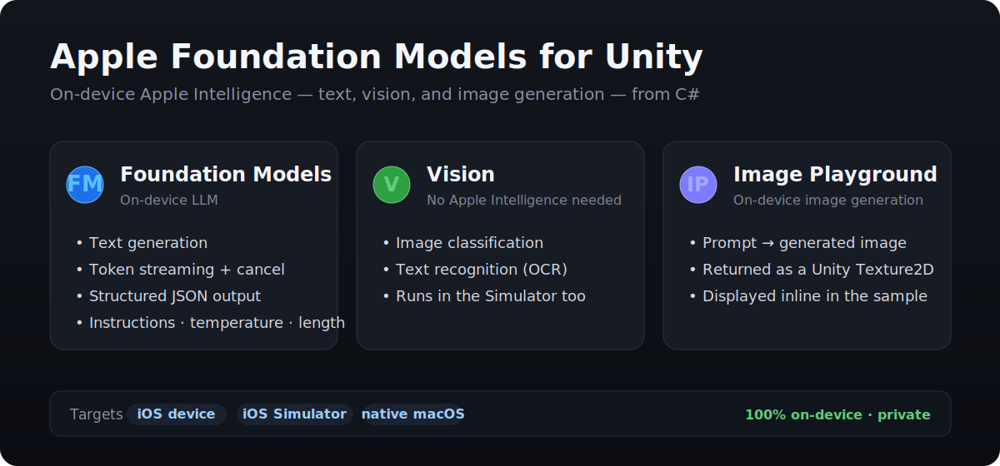
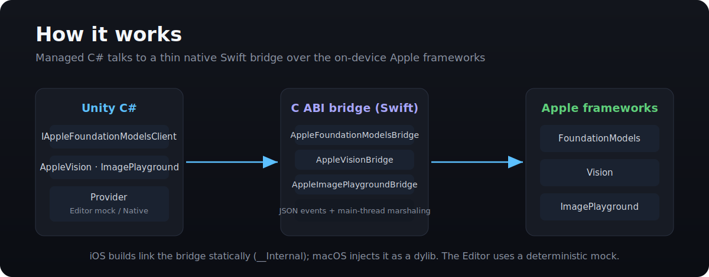

# Apple Foundation Models for Unity

The missing Unity bridge for Apple's on-device Foundation Models.



Apple Foundation Models for Unity is an experimental, open-source Unity package that brings Apple's on-device intelligence to C#:

- **Foundation Models** (the on-device LLM): availability checks, text generation, token streaming, and structured JSON — with instructions, temperature, and length control, plus replaceable fallback providers.
- **Vision**: on-device image classification and text recognition (OCR) — no Apple Intelligence required, so it runs in the Simulator too.
- **Image Playground**: on-device image generation from a prompt, returned as a Unity `Texture2D`.

It builds for **iOS device, the iOS Simulator, and native macOS**, and everything runs 100% on-device.

> This is an independent community project. It is not an official Apple package and it does not expose every Apple Intelligence system feature.

## Current status

The managed core and iOS native bridge are implemented and validated locally through:

- strict Swift type-checking plus a native harness;
- Unity Edit Mode tests on the default target and the iOS target;
- repeatable Unity iOS export validation;
- `xcodebuild` compilation of the generated `UnityFramework` target with signing disabled.

The package also includes a reusable UI Toolkit diagnostic shell, presenter-based samples, a device validation sample that produces a privacy-safe report, and a **Capability Showcase** sample — one IMGUI scene that exercises every capability (Foundation Models, Vision, and Image Playground) on device, the Simulator, or a native macOS app.

Vision and Image Playground bridges and a native macOS standalone path have been added; the Foundation Models and Vision capabilities have been observed running on-device on an Apple Intelligence Mac.

## Requirements and platform support

- Unity 6 (6000.0) or newer.
- Unity Editor: deterministic mock provider plus the validation sample and reusable diagnostic shell.
- iOS: native bridge for iOS 26+ on eligible Apple Intelligence devices; exported-Xcode validation is automated locally.
- macOS: native provider for macOS 26 standalone builds on an Apple Intelligence Mac (the Unity Editor keeps the deterministic mock).
- Windows, Android, Linux, and WebGL: custom provider support; no native Apple model access.

## How it works



The managed C# API selects a provider (the deterministic mock in the Editor, or the native provider in a player) and talks to a thin C ABI Swift bridge over the on-device Apple frameworks. iOS builds link the bridge statically; native macOS builds inject it as a dynamic library.

## Install

Once this repository is published, add its Git URL in Unity Package Manager using **Add package from git URL**. During local development, use **Add package from disk** and select `package.json`.

## Use

```csharp
using Baran.AppleFoundationModels;

var availability = await AppleFoundationModels.GetAvailabilityAsync();
if (!availability.IsAvailable)
{
    UnityEngine.Debug.LogWarning(availability.Message);
    return;
}

var result = await AppleFoundationModels.GenerateTextAsync(
    "Generate one short funny NPC line for a cozy cat cafe game.");
UnityEngine.Debug.Log(result.Text);
```

Streaming uses token, completion, and error callbacks:

```csharp
await AppleFoundationModels.StreamTextAsync(
    "Name ten playful orange cats.",
    chunk => output.text += chunk,
    result => UnityEngine.Debug.Log("Complete"),
    error => UnityEngine.Debug.LogException(error));
```

Simple Unity-serializable classes can be populated from generated JSON:

```csharp
[System.Serializable]
public sealed class QuestData
{
    public string title;
    public string objective;
    public int rewardCoins;
}

QuestData quest = await AppleFoundationModels.GenerateJsonAsync<QuestData>(
    "Generate a short cozy fetch quest.");
```

## Custom providers

Implement `IAppleFoundationModelsProvider` and register it at application startup:

```csharp
AppleFoundationModels.SetProvider(myProvider);
// Later: AppleFoundationModels.ResetProvider();
```

This hook supports deterministic tests and optional local or cloud fallbacks without coupling the core package to any vendor. Review the privacy and cost behavior of any fallback before shipping it.

For dependency-injected components and samples, `AppleFoundationModels.DefaultClient` exposes the active `IAppleFoundationModelsClient` without exposing provider construction.

## Validate locally

Use the provided scripts from macOS:

```bash
./scripts/validate_swift_bridge.sh
./scripts/run_unity_editmode_tests.sh /Applications/Unity/Hub/Editor/6000.0.61f1/Unity.app/Contents/MacOS/Unity default
./scripts/run_unity_editmode_tests.sh /Applications/Unity/Hub/Editor/6000.0.61f1/Unity.app/Contents/MacOS/Unity ios
./scripts/validate_exported_ios_project.sh /Applications/Unity/Hub/Editor/6000.0.61f1/Unity.app/Contents/MacOS/Unity
./scripts/validate_package_release.sh v0.1.0
```

The GitHub Actions workflow runs the Swift bridge checks, release metadata validation, and Unity Edit Mode suites. The exported-Xcode build remains a local macOS validation step unless you attach a Unity-capable macOS runner.

## Project Settings

Open **Edit > Project Settings > Apple Foundation Models** to configure the Editor mock provider, native debug logging, default native timeout, and fallback policy. Settings are stored with the Unity project and exposed at runtime through the immutable `AppleFoundationModels.Configuration` snapshot.

## Project docs

- [Development plan](DEVELOPMENT_PLAN.md)
- [Getting started](Documentation~/getting-started.md)
- [Platform support](Documentation~/platform-support.md)
- [API reference](Documentation~/api-reference.md)
- [Native build notes](Documentation~/native-build-notes.md)

Licensed under the [MIT License](LICENSE).
